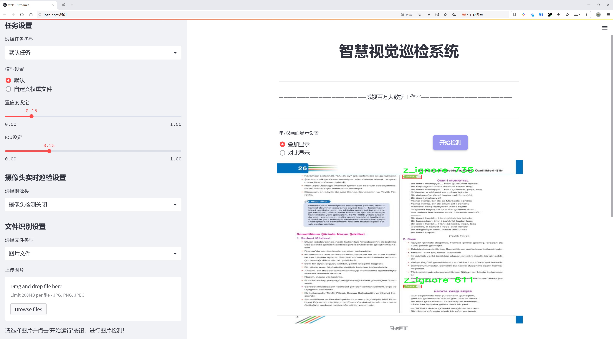
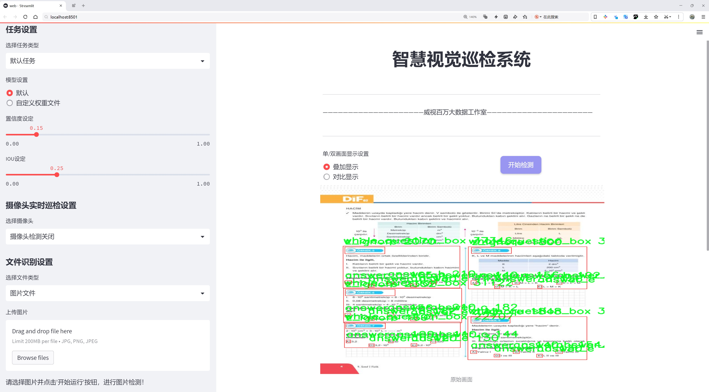
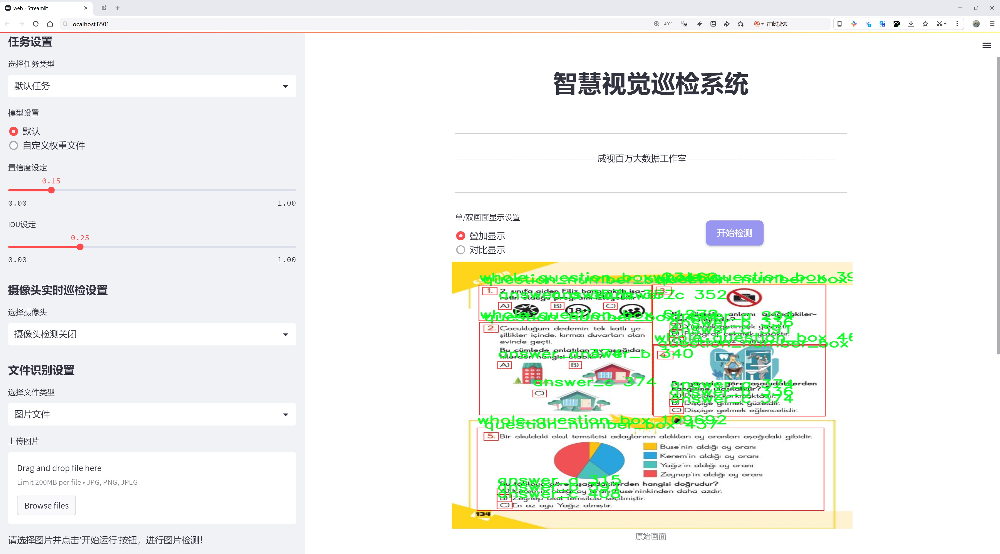
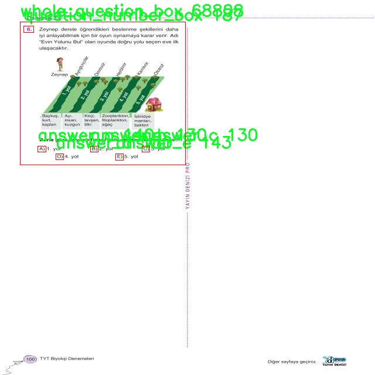
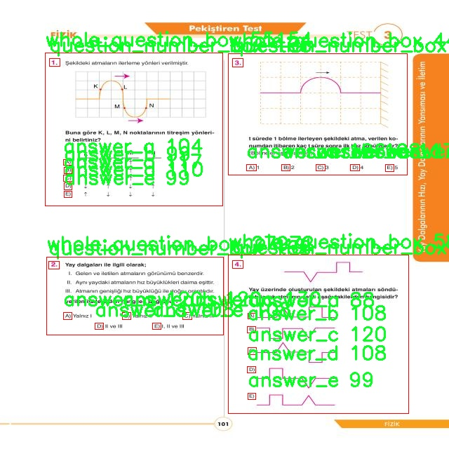
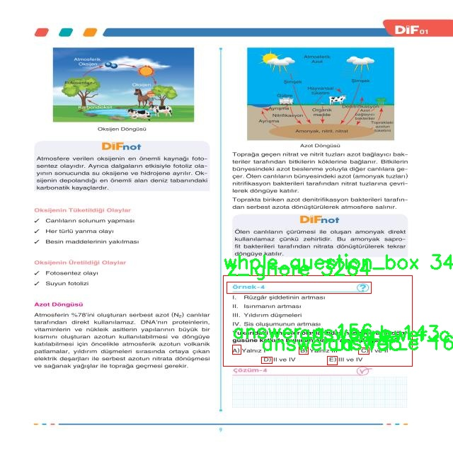
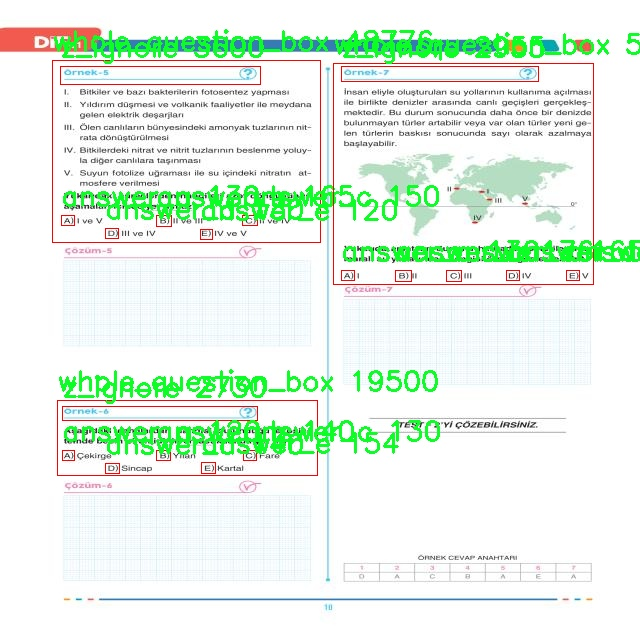
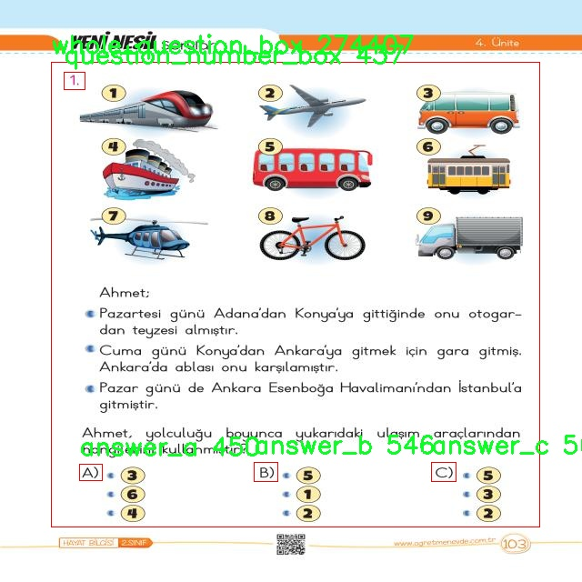

# 题目标题序号选项定位检测系统源码分享
 # [一条龙教学YOLOV8标注好的数据集一键训练_70+全套改进创新点发刊_Web前端展示]

### 1.研究背景与意义

项目参考[AAAI Association for the Advancement of Artificial Intelligence](https://gitee.com/qunmasj/projects)

项目来源[AACV Association for the Advancement of Computer Vision](https://kdocs.cn/l/cszuIiCKVNis)

研究背景与意义

随着信息技术的迅猛发展，自动化和智能化的需求日益增加，尤其是在教育领域，如何高效、准确地处理和分析大量的考试和测评数据成为了一个重要的研究课题。传统的手动阅卷和题目分析方法不仅耗时耗力，而且容易受到人为因素的影响，导致结果的不准确性。因此，基于计算机视觉和深度学习技术的自动化题目标题序号选项定位系统应运而生，成为提高教育评估效率和准确性的有效手段。

在这一背景下，YOLO（You Only Look Once）系列模型因其高效的实时目标检测能力而受到广泛关注。YOLOv8作为该系列的最新版本，进一步提升了检测精度和速度，适用于多种复杂场景下的目标识别任务。然而，针对特定应用场景，如题目标题序号选项的定位，YOLOv8的标准模型可能无法完全满足需求。因此，改进YOLOv8模型以适应特定的教育数据集，成为了一个具有重要意义的研究方向。

本研究所使用的数据集包含2400张图像，涵盖17个类别，具体包括题目选项（如answer_a、answer_b、answer_c等）、题目框（question_box）、解释框（explanation_box）等。这些类别的设计充分考虑了考试题目的结构特点，能够有效支持题目内容的自动识别与分析。通过对这些图像数据的深入分析和处理，研究者可以训练出一个高效的目标检测模型，不仅能够准确定位题目和选项，还能提高后续数据处理的自动化程度。

在教育评估的实际应用中，自动化的题目标题序号选项定位系统能够显著降低人工干预的需求，提高评卷的效率和准确性。尤其是在大规模考试或在线测评中，快速而准确的自动化处理系统能够为教育机构节省大量的人力和时间成本。此外，该系统的成功应用还可以为后续的教育数据分析提供坚实的基础，促进教育研究的深入发展。

综上所述，基于改进YOLOv8的题目标题序号选项定位系统的研究，不仅具有重要的理论价值，还具备广泛的实际应用前景。通过对教育数据集的深入挖掘和分析，研究者能够推动教育评估领域的智能化进程，为实现更加高效、公平的教育评估体系贡献力量。这一研究不仅是对现有技术的改进与创新，更是对教育公平与质量提升的积极探索，具有深远的社会意义和应用价值。

### 2.图片演示







##### 注意：由于此博客编辑较早，上面“2.图片演示”和“3.视频演示”展示的系统图片或者视频可能为老版本，新版本在老版本的基础上升级如下：（实际效果以升级的新版本为准）

  （1）适配了YOLOV8的“目标检测”模型和“实例分割”模型，通过加载相应的权重（.pt）文件即可自适应加载模型。

  （2）支持“图片识别”、“视频识别”、“摄像头实时识别”三种识别模式。

  （3）支持“图片识别”、“视频识别”、“摄像头实时识别”三种识别结果保存导出，解决手动导出（容易卡顿出现爆内存）存在的问题，识别完自动保存结果并导出到tempDir中。

  （4）支持Web前端系统中的标题、背景图等自定义修改，后面提供修改教程。

  另外本项目提供训练的数据集和训练教程,暂不提供权重文件（best.pt）,需要您按照教程进行训练后实现图片演示和Web前端界面演示的效果。

### 3.视频演示

[3.1 视频演示](https://www.bilibili.com/video/BV1aCtCe6Ee9/)

### 4.数据集信息展示

##### 4.1 本项目数据集详细数据（类别数＆类别名）

nc: 8
names: ['answer_a', 'answer_b', 'answer_c', 'answer_d', 'answer_e', 'question_number_box', 'whole_question_box', 'z_ignore']


##### 4.2 本项目数据集信息介绍

数据集信息展示

在现代计算机视觉领域，数据集的构建与选择对模型的训练效果至关重要。本研究所使用的数据集名为“nptorneklerlemore”，其设计旨在为改进YOLOv8的题目标题序号选项定位系统提供丰富的训练样本。该数据集包含8个类别，具体类别包括：‘answer_a’，‘answer_b’，‘answer_c’，‘answer_d’，‘answer_e’，‘question_number_box’，‘whole_question_box’，以及‘z_ignore’。这些类别的设置旨在涵盖题目和选项的多样性，以确保模型能够在实际应用中有效识别和定位不同类型的文本信息。

在数据集的构建过程中，我们充分考虑了各个类别的代表性和多样性。首先，‘answer_a’至‘answer_e’这五个类别代表了多项选择题中的不同选项。每个选项的样本均经过精心挑选，确保其在字体、颜色、背景和排版等方面具有一定的多样性。这种多样性使得模型在面对不同风格的题目时，能够更好地适应和识别各类选项，提升其泛化能力。

其次，‘question_number_box’和‘whole_question_box’这两个类别则专注于题目的整体结构。‘question_number_box’用于标识题目的序号部分，而‘whole_question_box’则涵盖了完整的题目文本。这两个类别的设计意在帮助模型理解题目的整体布局和逻辑关系，从而提高其在复杂文本环境中的定位精度。

值得注意的是，‘z_ignore’类别的引入是为了处理那些在训练过程中可能出现的无关信息或噪声。这一类别的样本主要包括背景图像、干扰元素或不相关的文本信息，模型在训练时会忽略这些样本，从而专注于重要的目标。这种设计不仅提升了模型的训练效率，也在一定程度上降低了误识别的风险。

数据集“nptorneklerlemore”的样本量丰富，涵盖了多种场景和布局，使得模型在训练过程中能够接触到广泛的情况。通过对数据集的细致标注和分类，我们期望能够训练出一个更加精准和高效的YOLOv8模型，以应对实际应用中的各种挑战。此外，数据集的构建还遵循了数据科学的伦理原则，确保所有样本均为合法获取，并经过适当的处理以保护隐私。

在未来的研究中，我们计划进一步扩展数据集的规模和类别，以涵盖更多的题型和选项形式，从而提升模型的适应性和鲁棒性。通过不断优化数据集和训练流程，我们希望能够推动题目标题序号选项定位系统的发展，为教育领域的智能化评测提供更为强大的技术支持。











### 5.全套项目环境部署视频教程（零基础手把手教学）

[5.1 环境部署教程链接（零基础手把手教学）](https://www.ixigua.com/7404473917358506534?logTag=c807d0cbc21c0ef59de5)


[5.2 安装Python虚拟环境创建和依赖库安装视频教程链接（零基础手把手教学）](https://www.ixigua.com/7404474678003106304?logTag=1f1041108cd1f708b01a)

### 6.手把手YOLOV8训练视频教程（零基础小白有手就能学会）

[6.1 手把手YOLOV8训练视频教程（零基础小白有手就能学会）](https://www.ixigua.com/7404477157818401292?logTag=d31a2dfd1983c9668658)

### 7.70+种全套YOLOV8创新点代码加载调参视频教程（一键加载写好的改进模型的配置文件）

[7.1 70+种全套YOLOV8创新点代码加载调参视频教程（一键加载写好的改进模型的配置文件）](https://www.ixigua.com/7404478314661806627?logTag=29066f8288e3f4eea3a4)

### 8.70+种全套YOLOV8创新点原理讲解（非科班也可以轻松写刊发刊，V10版本正在科研待更新）

由于篇幅限制，每个创新点的具体原理讲解就不一一展开，具体见下列网址中的创新点对应子项目的技术原理博客网址【Blog】：


[8.1 70+种全套YOLOV8创新点原理讲解链接](https://gitee.com/qunmasj/good)

### 9.系统功能展示（检测对象为举例，实际内容以本项目数据集为准）

图9.1.系统支持检测结果表格显示

  图9.2.系统支持置信度和IOU阈值手动调节

  图9.3.系统支持自定义加载权重文件best.pt(需要你通过步骤5中训练获得)

  图9.4.系统支持摄像头实时识别

  图9.5.系统支持图片识别

  图9.6.系统支持视频识别

  图9.7.系统支持识别结果文件自动保存

  图9.8.系统支持Excel导出检测结果数据


### 10.原始YOLOV8算法原理

原始YOLOv8算法原理

YOLOv8是目标检测领域的一次重要突破，作为YOLO系列的最新版本，它在算法设计上结合了多项先进的技术，旨在提高目标检测的准确性和效率。YOLOv8的整体架构可以分为输入层、主干网络、颈部网络和头部网络四个主要部分，每个部分在整个模型中都扮演着至关重要的角色。

首先，YOLOv8的输入层采用了自适应图像缩放技术。默认情况下，输入图像的尺寸为640x640，但在实际应用中，图像的长宽比往往各不相同。为了解决这一问题，YOLOv8在测试和推理阶段通过将长边按比例缩小到指定尺寸，然后对短边进行填充的方式，尽量减少信息冗余。这种方法不仅提高了目标检测的速度，还有效地保留了图像中的重要信息。此外，在模型训练过程中，YOLOv8引入了Mosaic图像增强技术，通过随机选择四张图像进行缩放和拼接，生成新的训练样本。这种增强方式使得模型能够学习到更多样化的特征，从而提升了预测的精度和模型的整体性能。

接下来，YOLOv8的主干网络采用了C2F模块，取代了YOLOv5中的C3模块。C2F模块的设计灵感来源于YOLOv7中的E-ELAN结构，通过并行的梯度流分支来增强特征提取的能力。这种设计不仅提高了模型的特征表达能力，还改善了梯度流动，确保了模型在训练过程中的稳定性和收敛速度。主干网络的最后，YOLOv8引入了SPPFl块，利用三个最大池化层处理多尺度特征，进一步增强了网络的特征抽象能力，使得模型能够更好地适应不同大小和形状的目标。

在颈部网络部分，YOLOv8结合了FPNS（Feature Pyramid Network）和PAN（Path Aggregation Network）结构，以实现不同尺度特征图的信息融合。这一设计使得模型能够在不同层次上有效地提取和融合特征，从而提升了对复杂场景的理解能力。通过这种多尺度特征融合，YOLOv8能够更好地处理不同大小的目标，确保在各种应用场景下都能保持较高的检测精度。

YOLOv8的头部网络是其最显著的创新之一，采用了解耦的检测头结构。这一结构将目标检测任务中的分类和回归分为两个独立的分支，使得每个分支能够专注于自身的任务，从而有效地解决了复杂场景下的定位不准和分类错误的问题。具体而言，解耦头通过两个并行的卷积分支分别计算类别和边界框的位置，这种设计不仅提高了模型的灵活性，还显著提升了检测的准确性。

在损失函数的设计上，YOLOv8也进行了创新。传统的目标检测模型在训练过程中通常会面临逻辑不一致性的问题，而YOLOv8通过取消Obj分支，采用BCELoss（Binary Cross Entropy Loss）和DFL（Distribution Focal Loss）结合CIoULoss（Complete Intersection over Union Loss）的方式，使得模型在训练时能够更快地聚焦于标签附近的数值，从而提高了模型的收敛速度和检测精度。

值得一提的是，YOLOv8摒弃了传统的Anchor-Based（基于锚框）方法，转而采用Anchor-Free（无锚框）的方法。这一转变使得YOLOv8在目标检测时不再依赖于预设的锚框，而是将目标检测问题转化为关键点检测。通过这种方式，YOLOv8能够直接预测目标的位置和大小，简化了模型的设计，并提升了其泛化能力。这种无锚框的方法使得YOLOv8在处理不同尺度和形状的目标时更加灵活，同时减少了计算复杂度，提高了检测速度。

综上所述，YOLOv8通过引入自适应图像缩放、C2F模块、特征融合网络、解耦检测头以及无锚框检测等多项创新技术，极大地提升了目标检测的性能和效率。其设计理念不仅关注模型的准确性，还注重计算效率，使得YOLOv8能够在实时检测任务中表现出色。作为YOLO系列的最新进展，YOLOv8无疑为目标检测领域提供了新的思路和方法，推动了这一领域的进一步发展。


### 11.项目核心源码讲解（再也不用担心看不懂代码逻辑）

#### 11.1 code\ultralytics\utils\callbacks\wb.py

以下是经过简化和注释的核心代码部分，保留了最重要的功能和逻辑：

```python
# 导入必要的库
from ultralytics.utils import SETTINGS, TESTS_RUNNING
from ultralytics.utils.torch_utils import model_info_for_loggers

try:
    # 确保当前不是在测试环境中
    assert not TESTS_RUNNING  
    # 确保WandB集成已启用
    assert SETTINGS["wandb"] is True  
    import wandb as wb  # 导入WandB库

    # 确保WandB库已正确安装
    assert hasattr(wb, "__version__")  

    import numpy as np
    import pandas as pd

    # 用于记录已处理的图表
    _processed_plots = {}

except (ImportError, AssertionError):
    wb = None  # 如果导入失败，则将wb设置为None


def _custom_table(x, y, classes, title="Precision Recall Curve", x_title="Recall", y_title="Precision"):
    """
    创建并记录自定义的精确度-召回率曲线可视化。
    """
    # 创建数据框
    df = pd.DataFrame({"class": classes, "y": y, "x": x}).round(3)
    fields = {"x": "x", "y": "y", "class": "class"}
    string_fields = {"title": title, "x-axis-title": x_title, "y-axis-title": y_title}
    
    # 返回WandB表格对象
    return wb.plot_table(
        "wandb/area-under-curve/v0", wb.Table(dataframe=df), fields=fields, string_fields=string_fields
    )


def _plot_curve(x, y, names=None, id="precision-recall", title="Precision Recall Curve", x_title="Recall", y_title="Precision", num_x=100, only_mean=False):
    """
    记录一个度量曲线的可视化。
    """
    if names is None:
        names = []
    
    # 创建新的x值
    x_new = np.linspace(x[0], x[-1], num_x).round(5)

    # 记录x和y的值
    x_log = x_new.tolist()
    y_log = np.interp(x_new, x, np.mean(y, axis=0)).round(3).tolist()

    if only_mean:
        # 仅记录均值曲线
        table = wb.Table(data=list(zip(x_log, y_log)), columns=[x_title, y_title])
        wb.run.log({title: wb.plot.line(table, x_title, y_title, title=title)})
    else:
        # 记录每个类的曲线
        classes = ["mean"] * len(x_log)
        for i, yi in enumerate(y):
            x_log.extend(x_new)  # 添加新的x值
            y_log.extend(np.interp(x_new, x, yi))  # 插值y到新的x
            classes.extend([names[i]] * len(x_new))  # 添加类名
        wb.log({id: _custom_table(x_log, y_log, classes, title, x_title, y_title)}, commit=False)


def on_fit_epoch_end(trainer):
    """在每个训练周期结束时记录训练指标和模型信息。"""
    wb.run.log(trainer.metrics, step=trainer.epoch + 1)  # 记录当前周期的指标
    _log_plots(trainer.plots, step=trainer.epoch + 1)  # 记录训练图表
    if trainer.epoch == 0:
        wb.run.log(model_info_for_loggers(trainer), step=trainer.epoch + 1)  # 记录模型信息


def on_train_end(trainer):
    """在训练结束时保存最佳模型并记录图表。"""
    _log_plots(trainer.validator.plots, step=trainer.epoch + 1)  # 记录验证图表
    art = wb.Artifact(type="model", name=f"run_{wb.run.id}_model")  # 创建模型工件
    if trainer.best.exists():
        art.add_file(trainer.best)  # 添加最佳模型文件
        wb.run.log_artifact(art, aliases=["best"])  # 记录工件
    wb.run.finish()  # 结束WandB运行


# 定义回调函数
callbacks = (
    {
        "on_fit_epoch_end": on_fit_epoch_end,
        "on_train_end": on_train_end,
    }
    if wb
    else {}
)
```

### 代码说明：
1. **导入库**：导入了必要的库，包括WandB用于可视化和记录模型训练过程。
2. **异常处理**：通过`try-except`块确保在导入WandB库时的安全性。
3. **自定义表格**：`_custom_table`函数用于创建精确度-召回率曲线的可视化表格。
4. **绘制曲线**：`_plot_curve`函数根据输入数据生成并记录曲线，可选择记录均值或每个类的曲线。
5. **训练周期结束回调**：`on_fit_epoch_end`函数在每个训练周期结束时记录训练指标和模型信息。
6. **训练结束回调**：`on_train_end`函数在训练结束时保存最佳模型并记录相关图表。

以上代码展示了如何在训练过程中使用WandB进行可视化和记录，帮助开发者监控模型性能。

这个文件是Ultralytics YOLO项目中的一个回调模块，主要用于与Weights & Biases（wandb）集成，以便在训练过程中记录和可视化模型的性能指标。文件中首先导入了一些必要的库和模块，并进行了基本的错误处理，以确保在运行时wandb库可用且未处于测试状态。

文件定义了一些函数来处理不同的可视化和日志记录任务。首先，`_custom_table`函数用于创建和记录一个自定义的精确度-召回曲线（Precision-Recall Curve）。它接收x轴和y轴的数据、类别标签以及图表的标题等参数，构建一个数据框并将其传递给wandb进行可视化。

接下来，`_plot_curve`函数用于生成和记录一个度量曲线的可视化。这个函数可以处理多个类别的数据，并根据`only_mean`参数决定是记录所有类别的曲线还是仅记录平均曲线。它使用`numpy`进行插值处理，以便在可视化中生成平滑的曲线。

`_log_plots`函数则负责记录来自输入字典的图表，确保在指定的步骤中不会重复记录相同的图表。

在训练过程的不同阶段，文件定义了一些回调函数，例如`on_pretrain_routine_start`、`on_fit_epoch_end`、`on_train_epoch_end`和`on_train_end`。这些函数在训练的不同阶段被调用，分别用于初始化wandb项目、记录训练指标、保存图像以及在训练结束时保存最佳模型。

最后，文件将这些回调函数整理成一个字典，只有在wandb可用的情况下才会使用这些回调。这种设计使得在使用wandb进行实验跟踪和可视化时，用户能够方便地集成这些功能，从而更好地监控模型的训练过程和性能。

#### 11.2 ui.py

```python
import sys
import subprocess

def run_script(script_path):
    """
    使用当前 Python 环境运行指定的脚本。

    Args:
        script_path (str): 要运行的脚本路径

    Returns:
        None
    """
    # 获取当前 Python 解释器的路径
    python_path = sys.executable

    # 构建运行命令，使用 streamlit 运行指定的脚本
    command = f'"{python_path}" -m streamlit run "{script_path}"'

    # 执行命令
    result = subprocess.run(command, shell=True)
    # 检查命令执行结果，如果返回码不为0，则表示出错
    if result.returncode != 0:
        print("脚本运行出错。")

# 主程序入口
if __name__ == "__main__":
    # 指定要运行的脚本路径
    script_path = "web.py"  # 这里可以替换为实际的脚本路径

    # 调用函数运行脚本
    run_script(script_path)
```

### 代码注释说明：
1. **导入模块**：
   - `sys`：用于获取当前 Python 解释器的路径。
   - `subprocess`：用于执行外部命令。

2. **定义 `run_script` 函数**：
   - 该函数接收一个参数 `script_path`，表示要运行的 Python 脚本的路径。
   - 使用 `sys.executable` 获取当前 Python 解释器的路径。
   - 构建一个命令字符串，使用 `streamlit` 模块运行指定的脚本。
   - 使用 `subprocess.run` 执行构建的命令，并检查执行结果的返回码。如果返回码不为0，表示脚本运行出错，打印错误信息。

3. **主程序入口**：
   - 使用 `if __name__ == "__main__":` 确保该部分代码仅在直接运行脚本时执行。
   - 指定要运行的脚本路径 `script_path`，并调用 `run_script` 函数来执行该脚本。

这个程序文件名为 `ui.py`，主要功能是通过当前的 Python 环境运行一个指定的脚本。程序首先导入了必要的模块，包括 `sys`、`os` 和 `subprocess`，以及一个自定义模块 `QtFusion.path` 中的 `abs_path` 函数。

在 `run_script` 函数中，首先定义了一个参数 `script_path`，用于接收要运行的脚本的路径。函数内部首先获取当前 Python 解释器的路径，这通过 `sys.executable` 实现。接着，构建一个命令字符串，该命令用于运行 `streamlit`，并将指定的脚本路径作为参数传入。命令的格式为 `"{python_path}" -m streamlit run "{script_path}"`，其中 `python_path` 是当前 Python 解释器的路径，`script_path` 是要运行的脚本路径。

然后，使用 `subprocess.run` 方法执行构建好的命令。这个方法会在新的 shell 中运行命令，并等待其完成。如果命令执行的返回码不为 0，表示脚本运行出错，程序会输出一条错误信息。

在文件的最后部分，使用 `if __name__ == "__main__":` 来判断当前模块是否是主程序。若是，则指定要运行的脚本路径为 `web.py`，这个路径通过 `abs_path` 函数获取其绝对路径。最后，调用 `run_script` 函数来执行这个脚本。

整体来看，这个程序的目的是提供一个简单的接口，通过 Python 环境来运行一个 Streamlit 应用脚本，便于开发和测试。

#### 11.3 70+种YOLOv8算法改进源码大全和调试加载训练教程（非必要）\ultralytics\data\build.py

以下是经过简化和注释的核心代码部分：

```python
import os
import random
import numpy as np
import torch
from torch.utils.data import dataloader
from .dataset import YOLODataset  # 导入YOLO数据集类
from .utils import PIN_MEMORY  # 导入内存固定的工具

class InfiniteDataLoader(dataloader.DataLoader):
    """
    无限数据加载器，重用工作线程。
    继承自PyTorch的DataLoader，支持无限循环遍历数据。
    """

    def __init__(self, *args, **kwargs):
        """初始化无限数据加载器，重置批次采样器为重复采样器。"""
        super().__init__(*args, **kwargs)
        object.__setattr__(self, 'batch_sampler', _RepeatSampler(self.batch_sampler))
        self.iterator = super().__iter__()

    def __len__(self):
        """返回批次采样器的长度。"""
        return len(self.batch_sampler.sampler)

    def __iter__(self):
        """创建一个无限循环的迭代器。"""
        for _ in range(len(self)):
            yield next(self.iterator)

    def reset(self):
        """重置迭代器，适用于训练过程中修改数据集设置。"""
        self.iterator = self._get_iterator()

class _RepeatSampler:
    """
    无限重复的采样器。
    """

    def __init__(self, sampler):
        """初始化重复采样器。"""
        self.sampler = sampler

    def __iter__(self):
        """无限迭代采样器的内容。"""
        while True:
            yield from iter(self.sampler)

def seed_worker(worker_id):
    """设置数据加载器工作线程的随机种子，以确保可重复性。"""
    worker_seed = torch.initial_seed() % 2 ** 32
    np.random.seed(worker_seed)
    random.seed(worker_seed)

def build_yolo_dataset(cfg, img_path, batch, data, mode='train', rect=False, stride=32):
    """构建YOLO数据集。"""
    return YOLODataset(
        img_path=img_path,
        imgsz=cfg.imgsz,  # 图像大小
        batch_size=batch,  # 批次大小
        augment=mode == 'train',  # 是否进行数据增强
        hyp=cfg,  # 超参数配置
        rect=cfg.rect or rect,  # 是否使用矩形批次
        cache=cfg.cache or None,  # 是否缓存数据
        single_cls=cfg.single_cls or False,  # 是否单类检测
        stride=int(stride),  # 步幅
        pad=0.0 if mode == 'train' else 0.5,  # 填充
        classes=cfg.classes,  # 类别
        data=data,  # 数据配置
        fraction=cfg.fraction if mode == 'train' else 1.0  # 训练时使用的样本比例
    )

def build_dataloader(dataset, batch, workers, shuffle=True, rank=-1):
    """返回用于训练或验证集的InfiniteDataLoader或DataLoader。"""
    batch = min(batch, len(dataset))  # 确保批次大小不超过数据集大小
    nd = torch.cuda.device_count()  # CUDA设备数量
    nw = min([os.cpu_count() // max(nd, 1), batch if batch > 1 else 0, workers])  # 工作线程数量
    sampler = None if rank == -1 else distributed.DistributedSampler(dataset, shuffle=shuffle)  # 分布式采样器
    generator = torch.Generator()
    generator.manual_seed(6148914691236517205 + RANK)  # 设置随机种子
    return InfiniteDataLoader(dataset=dataset,
                              batch_size=batch,
                              shuffle=shuffle and sampler is None,
                              num_workers=nw,
                              sampler=sampler,
                              pin_memory=PIN_MEMORY,
                              worker_init_fn=seed_worker)  # 初始化工作线程的随机种子

def check_source(source):
    """检查输入源类型并返回相应的标志值。"""
    # 初始化各种标志
    webcam, screenshot, from_img, in_memory, tensor = False, False, False, False, False
    if isinstance(source, (str, int, Path)):  # 支持字符串、整数或路径
        source = str(source)
        is_file = Path(source).suffix[1:] in (IMG_FORMATS + VID_FORMATS)  # 检查是否为文件
        is_url = source.lower().startswith(('https://', 'http://', 'rtsp://', 'rtmp://', 'tcp://'))  # 检查是否为URL
        webcam = source.isnumeric() or source.endswith('.streams') or (is_url and not is_file)  # 检查是否为摄像头
        screenshot = source.lower() == 'screen'  # 检查是否为屏幕截图
    elif isinstance(source, LOADERS):
        in_memory = True  # 如果是LOADERS类型，则标记为内存中
    elif isinstance(source, (list, tuple)):
        source = autocast_list(source)  # 转换列表元素为PIL或numpy数组
        from_img = True
    elif isinstance(source, (Image.Image, np.ndarray)):
        from_img = True  # 如果是图像或数组
    elif isinstance(source, torch.Tensor):
        tensor = True  # 如果是张量
    else:
        raise TypeError('不支持的图像类型。')

    return source, webcam, screenshot, from_img, in_memory, tensor

def load_inference_source(source=None, imgsz=640, vid_stride=1, buffer=False):
    """
    加载用于目标检测的推理源并应用必要的转换。
    """
    source, webcam, screenshot, from_img, in_memory, tensor = check_source(source)  # 检查源类型
    # 根据源类型加载数据集
    if tensor:
        dataset = LoadTensor(source)
    elif in_memory:
        dataset = source
    elif webcam:
        dataset = LoadStreams(source, imgsz=imgsz, vid_stride=vid_stride, buffer=buffer)
    elif screenshot:
        dataset = LoadScreenshots(source, imgsz=imgsz)
    elif from_img:
        dataset = LoadPilAndNumpy(source, imgsz=imgsz)
    else:
        dataset = LoadImages(source, imgsz=imgsz, vid_stride=vid_stride)

    return dataset  # 返回加载的数据集
```

### 代码说明：
1. **InfiniteDataLoader**: 这是一个自定义的数据加载器，允许无限循环遍历数据集，适合训练时需要多次遍历数据的场景。
2. **_RepeatSampler**: 这是一个辅助类，用于实现无限重复的采样器。
3. **seed_worker**: 这个函数用于设置数据加载器工作线程的随机种子，以确保每次训练时数据的随机性可控。
4. **build_yolo_dataset**: 该函数用于构建YOLO数据集，接收配置、图像路径、批次大小等参数。
5. **build_dataloader**: 该函数用于创建数据加载器，支持分布式训练和多线程加载。
6. **check_source**: 该函数用于检查输入源的类型，并返回相应的标志，帮助后续处理。
7. **load_inference_source**: 该函数用于加载推理源，适用于目标检测任务，能够根据不同的输入类型加载相应的数据集。

这个程序文件是用于构建YOLOv8算法的数据加载器和数据集的相关功能。首先，文件引入了一些必要的库，包括操作系统相关的库、随机数生成库、路径处理库、NumPy、PyTorch以及图像处理库PIL。接着，导入了一些与数据加载相关的模块和工具。

文件中定义了一个名为`InfiniteDataLoader`的类，它继承自PyTorch的`DataLoader`。这个类的主要功能是创建一个可以无限循环的迭代器，以便在训练过程中不断地从数据集中获取数据。`InfiniteDataLoader`重写了`__len__`和`__iter__`方法，使得每次迭代都能返回新的数据。此外，它还提供了一个`reset`方法，用于在训练过程中重置迭代器，以便可以在修改数据集设置时使用。

为了支持无限循环的功能，文件中还定义了一个名为`_RepeatSampler`的类。这个类的作用是不断重复给定的采样器，确保在迭代过程中可以不断地获取数据。

接下来，文件定义了一个`seed_worker`函数，用于设置数据加载器工作线程的随机种子，以确保在多线程环境下的随机性可控。

`build_yolo_dataset`函数用于构建YOLO数据集。它接受多个参数，包括配置文件、图像路径、批量大小等。该函数会根据训练模式和其他参数设置数据集的属性，比如是否进行数据增强、是否使用单类数据等。

`build_dataloader`函数则用于返回一个`InfiniteDataLoader`或标准的`DataLoader`，根据传入的数据集、批量大小、工作线程数等参数进行配置。它还考虑了CUDA设备的数量和分布式训练的情况。

`check_source`函数用于检查输入源的类型，并返回相应的标志值。这些标志值用于确定输入源是来自文件、网络摄像头、图像、视频等，以便后续处理。

最后，`load_inference_source`函数用于加载推理源，支持多种输入类型，包括字符串、路径、张量、PIL图像和NumPy数组。根据输入源的类型，函数会选择相应的加载方式，并返回一个数据集对象。

整体来看，这个文件提供了YOLOv8算法中数据加载和处理的基础设施，确保在训练和推理过程中能够高效地管理和获取数据。

#### 11.4 train.py

以下是代码中最核心的部分，并附上详细的中文注释：

```python
class DetectionTrainer(BaseTrainer):
    """
    DetectionTrainer类，继承自BaseTrainer类，用于基于检测模型的训练。
    """

    def build_dataset(self, img_path, mode="train", batch=None):
        """
        构建YOLO数据集。

        参数:
            img_path (str): 包含图像的文件夹路径。
            mode (str): 模式，`train`表示训练模式，`val`表示验证模式，用户可以为每种模式自定义不同的增强。
            batch (int, optional): 批次大小，仅用于`rect`模式。默认为None。
        """
        gs = max(int(de_parallel(self.model).stride.max() if self.model else 0), 32)
        return build_yolo_dataset(self.args, img_path, batch, self.data, mode=mode, rect=mode == "val", stride=gs)

    def get_dataloader(self, dataset_path, batch_size=16, rank=0, mode="train"):
        """构造并返回数据加载器。"""
        assert mode in ["train", "val"]  # 确保模式是训练或验证
        with torch_distributed_zero_first(rank):  # 在分布式训练中，仅初始化数据集一次
            dataset = self.build_dataset(dataset_path, mode, batch_size)  # 构建数据集
        shuffle = mode == "train"  # 训练模式下打乱数据
        if getattr(dataset, "rect", False) and shuffle:
            LOGGER.warning("WARNING ⚠️ 'rect=True'与DataLoader的shuffle不兼容，设置shuffle=False")
            shuffle = False
        workers = self.args.workers if mode == "train" else self.args.workers * 2  # 设置工作线程数
        return build_dataloader(dataset, batch_size, workers, shuffle, rank)  # 返回数据加载器

    def preprocess_batch(self, batch):
        """对一批图像进行预处理，包括缩放和转换为浮点数。"""
        batch["img"] = batch["img"].to(self.device, non_blocking=True).float() / 255  # 将图像转移到设备并归一化
        if self.args.multi_scale:  # 如果启用多尺度
            imgs = batch["img"]
            sz = (
                random.randrange(self.args.imgsz * 0.5, self.args.imgsz * 1.5 + self.stride)
                // self.stride
                * self.stride
            )  # 随机选择新的尺寸
            sf = sz / max(imgs.shape[2:])  # 计算缩放因子
            if sf != 1:
                ns = [
                    math.ceil(x * sf / self.stride) * self.stride for x in imgs.shape[2:]
                ]  # 计算新的形状
                imgs = nn.functional.interpolate(imgs, size=ns, mode="bilinear", align_corners=False)  # 进行插值缩放
            batch["img"] = imgs  # 更新批次图像
        return batch

    def get_model(self, cfg=None, weights=None, verbose=True):
        """返回YOLO检测模型。"""
        model = DetectionModel(cfg, nc=self.data["nc"], verbose=verbose and RANK == -1)  # 创建检测模型
        if weights:
            model.load(weights)  # 加载权重
        return model

    def get_validator(self):
        """返回用于YOLO模型验证的DetectionValidator。"""
        self.loss_names = "box_loss", "cls_loss", "dfl_loss"  # 定义损失名称
        return yolo.detect.DetectionValidator(
            self.test_loader, save_dir=self.save_dir, args=copy(self.args), _callbacks=self.callbacks
        )  # 返回验证器

    def plot_training_samples(self, batch, ni):
        """绘制带有注释的训练样本。"""
        plot_images(
            images=batch["img"],
            batch_idx=batch["batch_idx"],
            cls=batch["cls"].squeeze(-1),
            bboxes=batch["bboxes"],
            paths=batch["im_file"],
            fname=self.save_dir / f"train_batch{ni}.jpg",
            on_plot=self.on_plot,
        )  # 绘制图像并保存

    def plot_metrics(self):
        """从CSV文件中绘制指标。"""
        plot_results(file=self.csv, on_plot=self.on_plot)  # 保存结果图像
```

### 代码核心部分说明：
1. **DetectionTrainer类**：这是一个用于训练YOLO检测模型的类，继承自基本训练器`BaseTrainer`。
2. **build_dataset方法**：用于构建YOLO数据集，支持训练和验证模式。
3. **get_dataloader方法**：构造数据加载器，确保在分布式训练中只初始化一次数据集。
4. **preprocess_batch方法**：对图像批次进行预处理，包括归一化和可选的多尺度调整。
5. **get_model方法**：返回YOLO检测模型，并可选择加载预训练权重。
6. **get_validator方法**：返回用于模型验证的验证器。
7. **plot_training_samples和plot_metrics方法**：用于可视化训练样本和训练过程中的指标。

这个程序文件 `train.py` 是一个用于训练 YOLO（You Only Look Once）目标检测模型的实现，继承自 `BaseTrainer` 类。程序中首先导入了一些必要的库和模块，包括数学运算、随机数生成、深度学习框架 PyTorch 相关的模块，以及一些用于数据处理和模型训练的工具。

`DetectionTrainer` 类是该文件的核心，负责构建数据集、获取数据加载器、预处理图像批次、设置模型属性、获取模型、进行模型验证、记录损失、显示训练进度、绘制训练样本和指标等功能。

在 `build_dataset` 方法中，程序根据给定的图像路径和模式（训练或验证）构建 YOLO 数据集。它会根据模型的步幅（stride）计算合适的图像大小，并调用 `build_yolo_dataset` 函数来生成数据集。

`get_dataloader` 方法用于构建数据加载器，确保在分布式训练时只初始化一次数据集，并根据模式决定是否打乱数据顺序。它还会根据模式设置工作线程的数量。

`preprocess_batch` 方法对图像批次进行预处理，包括将图像缩放到合适的大小并转换为浮点数格式。若启用多尺度训练，它会随机选择图像大小并调整图像尺寸。

`set_model_attributes` 方法用于设置模型的属性，包括类别数量和类别名称等信息。

`get_model` 方法返回一个 YOLO 检测模型实例，并可选择加载预训练权重。

`get_validator` 方法返回一个用于模型验证的 `DetectionValidator` 实例，记录损失名称以便后续分析。

`label_loss_items` 方法用于返回带有标签的训练损失字典，便于在训练过程中跟踪损失变化。

`progress_string` 方法生成一个格式化的字符串，显示训练进度，包括当前的 epoch、GPU 内存使用情况、损失值、实例数量和图像大小等信息。

`plot_training_samples` 方法用于绘制训练样本及其标注，便于可视化训练过程中的数据。

最后，`plot_metrics` 和 `plot_training_labels` 方法分别用于绘制训练过程中的指标和创建带标签的训练图，帮助用户分析模型的训练效果。

整体来看，这个文件实现了 YOLO 模型训练的各个环节，涵盖了数据准备、模型训练、损失记录和结果可视化等功能，是一个完整的目标检测训练框架。

#### 11.5 70+种YOLOv8算法改进源码大全和调试加载训练教程（非必要）\ultralytics\utils\loss.py

以下是代码中最核心的部分，并附上详细的中文注释：

```python
import torch
import torch.nn as nn
import torch.nn.functional as F

class BboxLoss(nn.Module):
    def __init__(self, reg_max, use_dfl=False):
        """初始化 BboxLoss 模块，设置最大正则化值和 DFL 设置。"""
        super().__init__()
        self.reg_max = reg_max  # 最大正则化值
        self.use_dfl = use_dfl  # 是否使用分布焦点损失
        self.nwd_loss = False  # 是否使用 Wasserstein 距离损失
        self.iou_ratio = 0.5  # IoU 比例

    def forward(self, pred_dist, pred_bboxes, anchor_points, target_bboxes, target_scores, target_scores_sum, fg_mask):
        """计算 IoU 损失和 DFL 损失。"""
        weight = target_scores.sum(-1)[fg_mask].unsqueeze(-1)  # 计算权重
        iou = bbox_iou(pred_bboxes[fg_mask], target_bboxes[fg_mask], xywh=False, CIoU=True)  # 计算 IoU

        # IoU 损失
        loss_iou = ((1.0 - iou) * weight).sum() / target_scores_sum
        
        # DFL 损失
        if self.use_dfl:
            target_ltrb = bbox2dist(anchor_points, target_bboxes, self.reg_max)  # 将目标框转换为分布形式
            loss_dfl = self._df_loss(pred_dist[fg_mask].view(-1, self.reg_max + 1), target_ltrb[fg_mask]) * weight
            loss_dfl = loss_dfl.sum() / target_scores_sum
        else:
            loss_dfl = torch.tensor(0.0).to(pred_dist.device)  # 如果不使用 DFL，损失为 0

        return loss_iou, loss_dfl  # 返回 IoU 损失和 DFL 损失

    @staticmethod
    def _df_loss(pred_dist, target):
        """返回 DFL 损失的总和。"""
        tl = target.long()  # 目标左边界
        tr = tl + 1  # 目标右边界
        wl = tr - target  # 左边权重
        wr = 1 - wl  # 右边权重
        # 计算分布焦点损失
        return (F.cross_entropy(pred_dist, tl.view(-1), reduction='none').view(tl.shape) * wl +
                F.cross_entropy(pred_dist, tr.view(-1), reduction='none').view(tl.shape) * wr).mean(-1, keepdim=True)

class v8DetectionLoss:
    """计算检测损失的标准类。"""

    def __init__(self, model):
        """初始化 v8DetectionLoss，定义模型相关属性和 BCE 损失函数。"""
        device = next(model.parameters()).device  # 获取模型设备
        m = model.model[-1]  # 获取检测模块
        self.bce = nn.BCEWithLogitsLoss(reduction='none')  # 定义 BCE 损失
        self.bbox_loss = BboxLoss(m.reg_max - 1, use_dfl=m.reg_max > 1).to(device)  # 初始化边界框损失

    def __call__(self, preds, batch):
        """计算总损失并返回。"""
        loss = torch.zeros(3, device=self.device)  # 初始化损失数组
        pred_distri, pred_scores = preds  # 获取预测的分布和分数

        # 计算目标框
        pred_bboxes = self.bbox_decode(anchor_points, pred_distri)  # 解码预测的边界框

        # 计算损失
        if fg_mask.sum():
            target_bboxes /= stride_tensor  # 归一化目标框
            loss[0], loss[2] = self.bbox_loss(pred_distri, pred_bboxes, anchor_points, target_bboxes, target_scores, target_scores_sum, fg_mask)

        return loss.sum() * batch_size, loss.detach()  # 返回总损失和分离的损失
```

### 代码核心部分解释：
1. **BboxLoss 类**：
   - 负责计算边界框的损失，包括 IoU 损失和可选的分布焦点损失（DFL）。
   - `forward` 方法中计算了 IoU 和 DFL 损失，并返回这两个损失的总和。

2. **v8DetectionLoss 类**：
   - 负责整合检测模型的损失计算。
   - 在初始化时设置了 BCE 损失和边界框损失。
   - `__call__` 方法计算并返回总损失。

这些类是目标检测模型中损失计算的核心部分，负责评估模型预测与真实值之间的差异，从而指导模型的训练过程。

这个文件包含了YOLOv8模型中用于计算损失的各种类和方法，主要用于目标检测、分割和姿态估计等任务。代码中定义了多个损失类，每个类实现了特定的损失计算逻辑，以便在训练过程中优化模型的性能。

首先，`SlideLoss`类和`EMASlideLoss`类实现了滑动损失的计算，目的是通过动态调整损失权重来增强模型对不同IoU（Intersection over Union）阈值的敏感性。这两个类都重写了`forward`方法，计算预测值与真实值之间的损失，并根据IoU的值调整损失的权重。

接下来，`VarifocalLoss`和`FocalLoss`类分别实现了变焦损失和焦点损失。这些损失函数通过对难以分类的样本给予更高的权重，来提高模型在不平衡数据集上的表现。`VarifocalLoss`特别适用于目标检测任务，结合了目标得分和标签信息来计算损失。

`BboxLoss`类用于计算边界框的损失，包括IoU损失和分布焦点损失（DFL）。该类根据预测的边界框和真实的边界框计算损失，并提供了多种IoU计算方式的选择，如CIoU和MPDIoU。

`KeypointLoss`类用于计算关键点的损失，主要用于姿态估计任务。它通过计算预测关键点与真实关键点之间的欧几里得距离来评估模型的性能。

`v8DetectionLoss`类是一个综合性的损失计算类，负责计算目标检测任务中的边界框损失、分类损失和DFL损失。它包含了对目标分配的逻辑，并在计算损失时考虑了不同的超参数和策略。

`v8SegmentationLoss`和`v8PoseLoss`类分别扩展了`v8DetectionLoss`，用于处理分割和姿态估计任务。这些类实现了特定于任务的损失计算逻辑，确保在不同任务中都能有效地优化模型。

最后，`v8ClassificationLoss`类用于计算分类任务的损失，使用交叉熵损失函数来评估模型的分类性能。

整体来看，这个文件提供了YOLOv8模型在训练过程中所需的各种损失计算方法，旨在通过不同的损失函数和策略来提高模型的准确性和鲁棒性。每个损失类都设计得相对独立，便于在不同的训练任务中灵活使用。

#### 11.6 70+种YOLOv8算法改进源码大全和调试加载训练教程（非必要）\ultralytics\trackers\track.py

以下是代码中最核心的部分，并附上详细的中文注释：

```python
# 导入必要的库和模块
from functools import partial
import torch
from ultralytics.utils import IterableSimpleNamespace, yaml_load
from ultralytics.utils.checks import check_yaml
from .bot_sort import BOTSORT
from .byte_tracker import BYTETracker

# 定义跟踪器映射字典
TRACKER_MAP = {'bytetrack': BYTETracker, 'botsort': BOTSORT}

def on_predict_start(predictor, persist=False):
    """
    在预测开始时初始化对象跟踪器。

    参数:
        predictor (object): 用于初始化跟踪器的预测器对象。
        persist (bool, optional): 如果跟踪器已经存在，是否保持其状态。默认为 False。

    异常:
        AssertionError: 如果 tracker_type 不是 'bytetrack' 或 'botsort'。
    """
    # 如果预测器已经有跟踪器且需要保持状态，则直接返回
    if hasattr(predictor, 'trackers') and persist:
        return
    
    # 检查并加载跟踪器的配置文件
    tracker = check_yaml(predictor.args.tracker)
    cfg = IterableSimpleNamespace(**yaml_load(tracker))
    
    # 确保跟踪器类型是支持的类型
    assert cfg.tracker_type in ['bytetrack', 'botsort'], \
        f"仅支持 'bytetrack' 和 'botsort'，但得到的是 '{cfg.tracker_type}'"
    
    # 初始化跟踪器列表
    trackers = []
    for _ in range(predictor.dataset.bs):
        # 根据配置创建对应的跟踪器实例
        tracker = TRACKER_MAP[cfg.tracker_type](args=cfg, frame_rate=30)
        trackers.append(tracker)
    
    # 将跟踪器列表赋值给预测器
    predictor.trackers = trackers

def on_predict_postprocess_end(predictor):
    """后处理检测到的框并更新对象跟踪。"""
    bs = predictor.dataset.bs  # 批量大小
    im0s = predictor.batch[1]  # 获取原始图像数据
    for i in range(bs):
        det = predictor.results[i].boxes.cpu().numpy()  # 获取检测结果
        if len(det) == 0:  # 如果没有检测到目标，跳过
            continue
        
        # 更新跟踪器并获取跟踪结果
        tracks = predictor.trackers[i].update(det, im0s[i])
        if len(tracks) == 0:  # 如果没有跟踪到目标，跳过
            continue
        
        idx = tracks[:, -1].astype(int)  # 获取跟踪的索引
        predictor.results[i] = predictor.results[i][idx]  # 更新检测结果
        predictor.results[i].update(boxes=torch.as_tensor(tracks[:, :-1]))  # 更新框数据

def register_tracker(model, persist):
    """
    为模型注册跟踪回调，以便在预测期间进行对象跟踪。

    参数:
        model (object): 要注册跟踪回调的模型对象。
        persist (bool): 如果跟踪器已经存在，是否保持其状态。
    """
    # 添加预测开始时的回调
    model.add_callback('on_predict_start', partial(on_predict_start, persist=persist))
    # 添加后处理结束时的回调
    model.add_callback('on_predict_postprocess_end', on_predict_postprocess_end)
```

### 代码核心部分说明：
1. **跟踪器初始化**：`on_predict_start` 函数负责在预测开始时初始化跟踪器。它检查配置文件，确保跟踪器类型有效，并为每个批次创建相应的跟踪器实例。

2. **后处理更新**：`on_predict_postprocess_end` 函数在检测完成后更新检测框和跟踪信息。它会遍历每个批次的检测结果，使用跟踪器更新目标的位置信息。

3. **回调注册**：`register_tracker` 函数用于将上述两个函数注册为模型的回调，以便在预测过程中自动调用。

这个程序文件是一个用于YOLO（You Only Look Once）算法的跟踪器实现，主要用于在目标检测过程中进行对象跟踪。文件中包含了一些重要的函数和逻辑，下面对其进行详细说明。

首先，文件导入了一些必要的库和模块，包括`torch`（用于深度学习的PyTorch库）、`IterableSimpleNamespace`和`yaml_load`（用于处理配置文件），以及`check_yaml`（用于检查YAML文件的有效性）。同时，还导入了两个跟踪器类`BOTSORT`和`BYTETracker`，并将它们映射到一个字典`TRACKER_MAP`中，以便根据配置选择相应的跟踪器。

在`on_predict_start`函数中，主要负责在预测开始时初始化跟踪器。函数接收一个预测器对象和一个可选的持久化参数。如果预测器已经有跟踪器并且持久化参数为真，则直接返回。接着，函数会检查预测器的跟踪器配置文件，并将其加载为一个配置对象。然后，函数会验证配置中的跟踪器类型是否为支持的类型（`bytetrack`或`botsort`）。如果不符合要求，会抛出一个断言错误。随后，函数会为每个批次创建相应的跟踪器实例，并将它们存储在预测器的`trackers`属性中。

`on_predict_postprocess_end`函数在预测后处理结束时被调用，主要用于更新检测到的目标框并进行对象跟踪。函数首先获取当前批次的大小和图像数据，然后遍历每个批次的结果。如果检测到的目标框为空，则跳过该批次。接着，调用相应的跟踪器的`update`方法来更新跟踪信息。如果没有跟踪到目标，则继续下一个批次。否则，函数会提取跟踪结果的索引，并根据这些索引更新预测结果中的目标框信息。

最后，`register_tracker`函数用于将跟踪回调注册到模型中，以便在预测过程中进行对象跟踪。该函数接收模型对象和持久化参数，并将`on_predict_start`和`on_predict_postprocess_end`两个回调函数添加到模型的预测流程中。

总体而言，这个程序文件实现了YOLOv8算法中的对象跟踪功能，通过不同的跟踪器来增强目标检测的准确性和连贯性。

### 12.系统整体结构（节选）

### 整体功能和构架概括

该项目是一个基于YOLOv8算法的目标检测和跟踪框架，旨在提供一个灵活且高效的工具，用于训练、推理和评估目标检测模型。整体架构包括数据加载、模型训练、损失计算、目标跟踪和可视化等多个模块。每个模块通过定义清晰的类和函数来实现特定的功能，从而使得整个系统可以方便地进行扩展和修改。

- **数据处理**：通过数据加载器和数据集构建，确保模型在训练和推理过程中能够高效地获取数据。
- **模型训练**：实现了训练过程中的各种功能，包括损失计算、模型验证和进度显示。
- **损失计算**：定义了多种损失函数，以适应不同的任务需求，如目标检测、分割和姿态估计。
- **目标跟踪**：实现了对象跟踪功能，通过不同的跟踪器增强目标检测的连贯性。
- **可视化和回调**：集成了可视化工具和回调机制，以便在训练过程中记录和展示模型性能。

### 文件功能整理表

| 文件路径                                                                                     | 功能描述                                                                                     |
|----------------------------------------------------------------------------------------------|----------------------------------------------------------------------------------------------|
| `D:\tools\20240809\code\ultralytics\utils\callbacks\wb.py`                                 | 集成Weights & Biases（wandb）进行训练过程中的指标记录和可视化。                           |
| `D:\tools\20240809\code\ui.py`                                                              | 提供一个接口，通过Python环境运行指定的Streamlit应用脚本。                                 |
| `D:\tools\20240809\code\70+种YOLOv8算法改进源码大全和调试加载训练教程（非必要）\ultralytics\data\build.py` | 构建YOLO数据集和数据加载器，支持无限循环迭代和多尺度训练。                                 |
| `D:\tools\20240809\code\train.py`                                                           | 实现YOLO模型的训练过程，包括数据准备、模型训练、损失记录和结果可视化等功能。               |
| `D:\tools\20240809\code\70+种YOLOv8算法改进源码大全和调试加载训练教程（非必要）\ultralytics\utils\loss.py` | 定义多种损失函数，用于目标检测、分割和姿态估计等任务，优化模型性能。                       |
| `D:\tools\20240809\code\70+种YOLOv8算法改进源码大全和调试加载训练教程（非必要）\ultralytics\trackers\track.py` | 实现YOLO模型的对象跟踪功能，支持不同的跟踪器以增强目标检测的连贯性。                       |
| `D:\tools\20240809\code\70+种YOLOv8算法改进源码大全和调试加载训练教程（非必要）\ultralytics\models\yolo\segment\predict.py` | 实现YOLO分割模型的推理功能，处理输入数据并返回分割结果。                                   |
| `D:\tools\20240809\code\ultralytics\models\utils\ops.py`                                   | 定义模型中使用的各种操作和函数，支持模型的构建和推理。                                     |
| `D:\tools\20240809\code\ultralytics\models\sam\modules\transformer.py`                     | 实现Transformer模块，可能用于模型的特征提取和处理。                                       |
| `D:\tools\20240809\code\ultralytics\nn\tasks.py`                                           | 定义与模型相关的任务和操作，可能包括模型的训练、推理和评估等功能。                       |
| `D:\tools\20240809\code\70+种YOLOv8算法改进源码大全和调试加载训练教程（非必要）\ultralytics\models\yolo\segment\__init__.py` | 初始化YOLO分割模型模块，组织和导出相关功能。                                               |
| `D:\tools\20240809\code\ultralytics\models\rtdetr\train.py`                                | 实现RT-DETR模型的训练过程，专注于实时目标检测任务。                                       |
| `D:\tools\20240809\code\ultralytics\trackers\utils\gmc.py`                                 | 实现与目标跟踪相关的工具和功能，可能包括图像处理和特征匹配等。                             |

以上表格总结了各个文件的主要功能，帮助理解整个项目的结构和功能模块。

注意：由于此博客编辑较早，上面“11.项目核心源码讲解（再也不用担心看不懂代码逻辑）”中部分代码可能会优化升级，仅供参考学习，完整“训练源码”、“Web前端界面”和“70+种创新点源码”以“13.完整训练+Web前端界面+70+种创新点源码、数据集获取”的内容为准。

### 13.完整训练+Web前端界面+70+种创新点源码、数据集获取


# [下载链接：https://mbd.pub/o/bread/ZpuYk5tu](https://mbd.pub/o/bread/ZpuYk5tu)